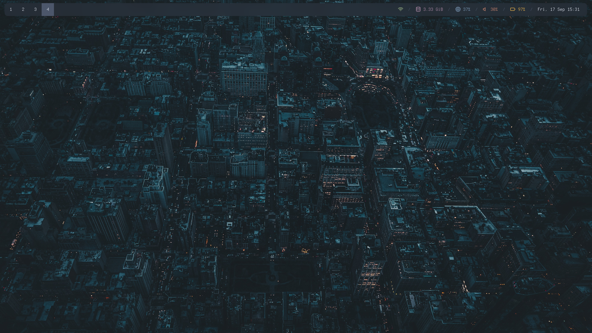
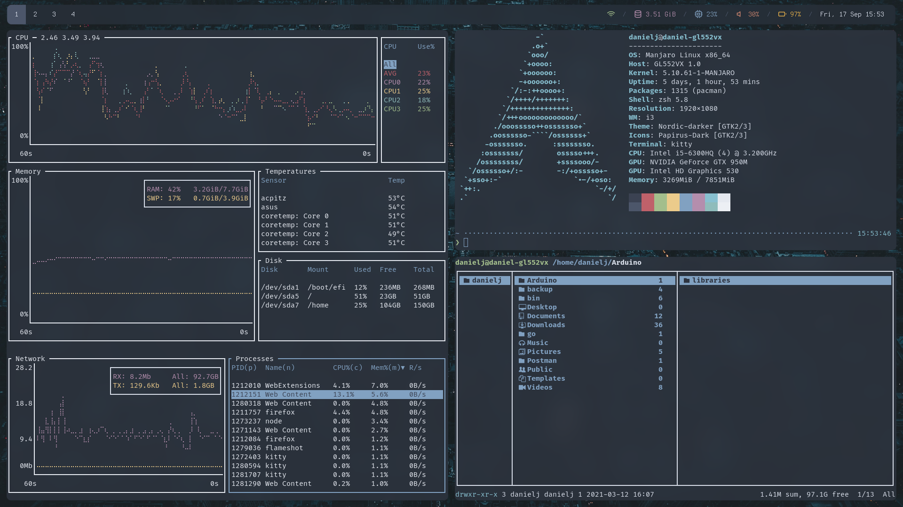
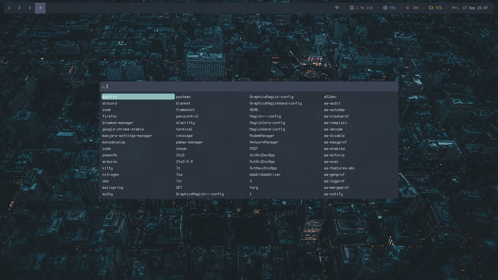
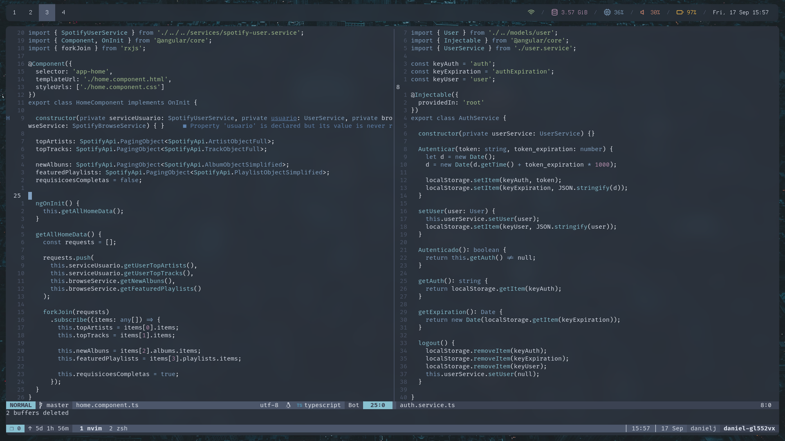
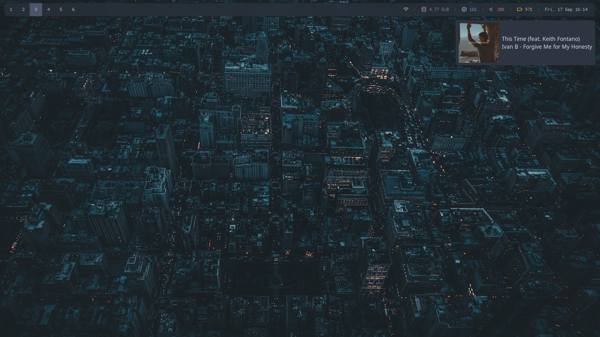

# Specs:

- **OS:** Manjaro Linux
- **WM:** i3 gaps
- **Shell:** zsh
- **Terminal:** kitty
- **Status bar:** polybar
- **Notifications:** Dunst
- **Compositor:** Picom (jonaburg)
- **Editor:** Neovim
- **Fonts:** FiraCode Nerd, Terminus (TTF)

# Screenshots:

